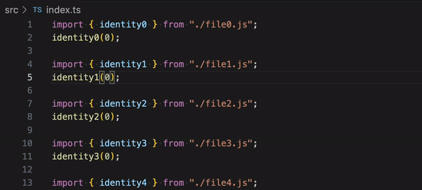

# Repro: Slow `eslint-plugin-prettier` Formatting with Typed Linting

Reproduction case showing very slow formatting as a result of slow typed linting.
Slow typed linting is common in projects large enough to have slow type checking.



## Setup

```shell
npm i
npm run generate
```

Then make any changes to a file under `src/`.
`src/index.ts` is the most type-intensive one.
