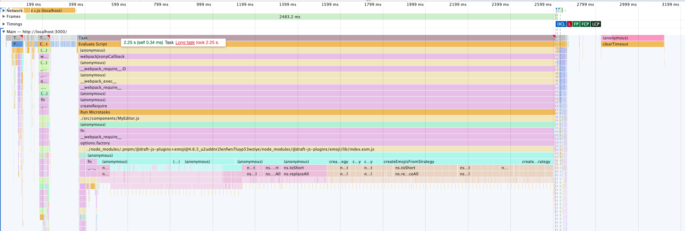
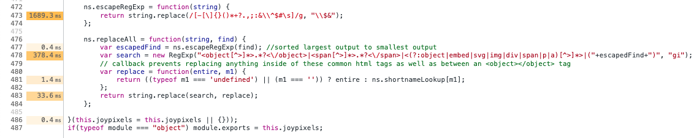

# Repro: Draft.js > Emoji Plugin > emoji-toolkit Performance

This is a [Next.js](https://nextjs.org/) project bootstrapped with [`create-next-app`](https://github.com/vercel/next.js/tree/canary/packages/create-next-app) and [pnpm](https://pnpm.io/).

Preparation:

```sh
pnpm install
```

Running a local dev server (which does display the issue):

```sh
pnpm dev
```

Alternately, creating a more optimized production build:

```sh
pnpm build
pnpm start
```

Open [http://localhost:3000](http://localhost:3000) with your browser to see the result.

## Description of Issue

This app has a minimum reproduction of using [emoji plugin`](https://www.draft-js-plugins.com/plugin/emoji) for [Draft.js](https://draftjs.org).
It demonstrates a >=2 second[^1] slowdown due to slow regular expressions.

### Performance Audit

1. Open the local dev page
2. In dev tools > _Performance_, run a _Start profiling and reload page_ for at least ~4-5 seconds.

We can see from this flame chart that a long task is taking upwards of _two seconds (!)_ to execute.



Digging into the call tree, it appears to be caused internally by two functions with >=100ms self time in `joypixels.js`:

- `ns.replaceAll`, which internally calls to:
  - `ns.escapeRegExp`

<!-- prettier-ignore -->
```js
    ns.escapeRegExp = function(string) {
        return string.replace(/[-[\]{}()*+?.,;:&\\^$#\s]/g, "\\$&");
    };

    ns.replaceAll = function(string, find) {
        var escapedFind = ns.escapeRegExp(find); //sorted largest output to smallest output
        var search = new RegExp("<object[^>]*>.*?<\/object>|<span[^>]*>.*?<\/span>|<(?:object|embed|svg|img|div|span|p|a)[^>]*>|("+escapedFind+")", "gi");
        // callback prevents replacing anything inside of these common html tags as well as between an <object></object> tag
        var replace = function(entire, m1) {
            return ((typeof m1 === 'undefined') || (m1 === '')) ? entire : ns.shortnameLookup[m1];
        };
        return string.replace(search, replace);
    };
```

Chrome's profiler has annotated the lines to show that the one line in `escapeRegExp` takes over a second and a half:



That file is located at an address like `webpack://_N_E/node_modules/.pnpm/emoji-toolkit@7.0.1/node_modules/emoji-toolkit/lib/js/joypixels.js?...`.
We can see it on GitHub at https://github.com/joypixels/emoji-toolkit/blob/7ed2733fac44df78fc7628cb51a0be5fb23066e3/lib/js/joypixels.js#L472.

[^1]: Measurements taken on a 2022 Mac Studio with an Apple M1 Max chip.
