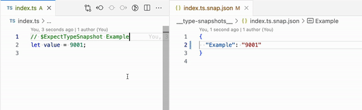

# Repro: eslint-plugin-expect-type and Editor Fixing

Reproduction case for [Change Request: Provide a way for rules to know whether they're in fix mode](https://github.com/eslint/eslint/issues/17881).



## Setup

Install dependencies with npm, then open in VS Code with the ESLint extension.

```plaintext
npm i
code .
```

Then open two files:

1. `index.ts`: which contains an `// $ExpectTypeSnapshot Example` per [`expect-type/expect`'s `$ExpectTypeSnapshot` docs](https://github.com/JoshuaKGoldberg/eslint-plugin-expect-type/blob/740cd7814cd06a9924df4e0087cf0c79fb3cb27b/docs/rules/expect.md#expecttypesnapshot)
2. `__type-snapshots__/index.ts.snap.json`: which will be updated as you edit the `value` variable in `index.ts`

## Problem Explanation

We'd expect that the type snapshot (`index.ts.snap.json`) should only be updated when the user takes explicit action.
I.e., running the rule's report fixer or suggestion fixer.

Instead, fixes and suggestions are applied _as `value` changes in real time_.
This is because `fix()` functions are run immediately in the editor.
