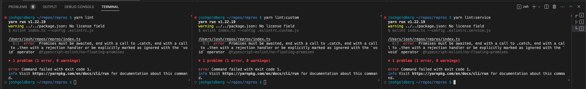

# Repro: ESLint & Project Service

> Context: https://github.com/typescript-eslint/typescript-eslint/pull/6754

This reproduction case shows three scenarios:

- `yarn lint`: Running with `project: true` to use a `tsconfig.json` for type information
- `yarn lint:custom`: Using a `.eslintrc.custom.js` to use a `tsconfig.custom.json` for type information
- `yarn lint:service`: Using `EXPERIMENTAL_projectService` to use a `tsconfig.json` for type information

## Setup

First clone `typescript-eslint` locally and

```shell
cd ~/path/to/your/repos
git clone https://github.com/typescript-eslint/typescript-eslint
cd typescript-eslint
git checkout create-project-service
yarn
cd packages
for packageName in `ls`; do
    cd $packageName
    yarn link
    cd ..
done
cd ..
```

Then set up this repro case and link to the local typescript-eslint packages

```shell
cd ~/path/to/your/repos
git clone https://github.com/JoshuaKGoldberg/repros
cd repros
git checkout typescript-eslint-different-paths-tsconfig
yarn
yarn link @typescript-eslint/eslint-plugin @typescript-eslint/parser @typescript-eslint/typescript-estree
```

Then, run any of the aforementioned `yarn lint` commands.

- `yarn lint` and `yarn lint:service` show a type error on `functionAsyncDefaultSyncESLint` (line 6): a function that creates a floating promise when resolved to the export from `./in-default/creator.ts`
- `yarn lint:custom` shows a type error on `functionSyncDefaultAsyncESLint` (line 8): a function that creates a floating promise when resolved to the export from `./in-custom/creator.ts`



## Confirming Program Source

To confirm that the project used by rules is created by the project service:

1. In `useProgramFromProjectService` > `useProgramFromProjectService`, just before the `return`, add:
   ```ts
   (program as any).__brand = "from project service";
   ```
1. In `parser.ts` > `parseAndGenerateServices`, after the `const { ast, program } = ...`, add:
   ```ts
   console.log("In parseAndGenerateServices", (program as any).__brand);
   ```
1. In `no-floating-promises.ts` > `create`, just before the `return`, add:
   ```ts
   console.log("In no-floating-promises", (services.program as any).__brand);
   ```
1. `yarn build` in `typescript-eslint`'s root

Then run `yarn lint:service` to see the brands being logged:

```shell
$ yarn lint:service
yarn run v1.22.19
$ eslint index.ts --config .eslintrc.service.js
In parseAndGenerateServices from project service
In no-floating-promises from project service

/Users/josh/repos/repros/index.ts
  6:1  error  Promises must be awaited, end with a call to .catch, end with a call to .then with a rejection handler or be explicitly marked as ignored with the `void` operator  @typescript-eslint/no-floating-promises

✖ 1 problem (1 error, 0 warnings)

error Command failed with exit code 1.
info Visit https://yarnpkg.com/en/docs/cli/run for documentation about this command.
```
