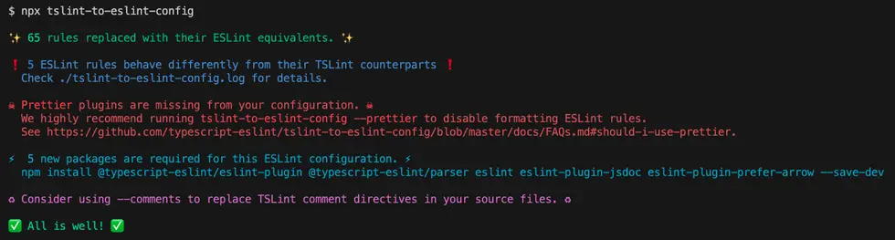

# tslint-to-eslint-config Example

```shell
npm i
npx -y tslint-to-eslint-config
```



```plaintext
✨ 65 rules replaced with their ESLint equivalents. ✨

❗ 5 ESLint rules behave differently from their TSLint counterparts ❗
  Check ./tslint-to-eslint-config.log for details.

☠ Prettier plugins are missing from your configuration. ☠
  We highly recommend running tslint-to-eslint-config --prettier to disable formatting ESLint rules.
  See https://github.com/typescript-eslint/tslint-to-eslint-config/blob/master/docs/FAQs.md#should-i-use-prettier.

⚡ 5 new packages are required for this ESLint configuration. ⚡
  npm install @typescript-eslint/eslint-plugin @typescript-eslint/parser eslint eslint-plugin-jsdoc eslint-plugin-prefer-arrow --save-dev

♻ Consider using --comments to replace TSLint comment directives in your source files. ♻

✅ All is well! ✅
```

`tslint-to-eslint-config.log`:

```plaintext
5 ESLint rules behave differently from their TSLint counterparts:
  * no-invalid-this:
    - Functions in methods will no longer be ignored.
  * @typescript-eslint/no-unused-expressions:
    - The TSLint optional config "allow-new" is the default ESLint behavior and will no longer be ignored.
  * prefer-arrow/prefer-arrow-functions:
    - ESLint (eslint-plugin-prefer-arrow plugin) does not support allowing named functions defined with the function keyword.
  * eqeqeq:
    - Option "smart" allows for comparing two literal values, evaluating the value of typeof and null comparisons.
  * no-underscore-dangle:
    - Leading and trailing underscores (_) on identifiers will now be ignored.
```
